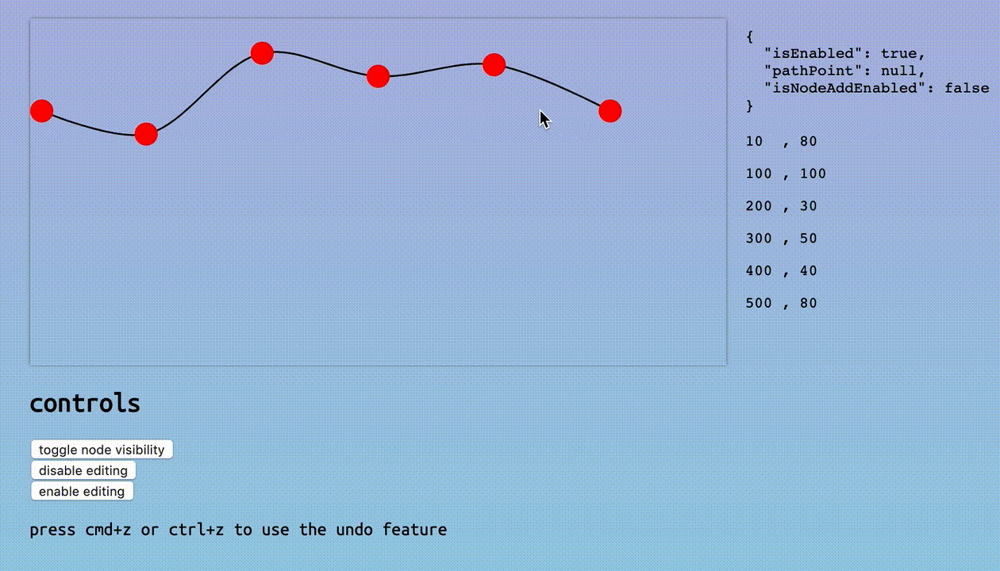

# @dino-dna/d3-svg-path-editor

create an editable svg [path](https://developer.mozilla.org/en-US/docs/Web/SVG/Element/path). a library to enable in-app path editing

[](https://standardjs.com)
[](https://github.com/semantic-release/semantic-release)
[](https://www.typescriptlang.org)


<div style='text-align: center;'>
  
</div>

see the [live, interactive demo](https://cdaringe.github.io/d3-svg-path-editor/)

## install

`npm install --save @dino-dna/d3-svg-path-editor d3`

on the topic of d3 and bundle performance, some minimal subset of d3 packages must be installed and added onto the `d3` instance. we use d3-line, d3-selection, and d3 events. `d3` experts are welcome to add documentation on how to optimize web builds here for d3 bundles!

## usage

create a path from a set of points and d3 svg instance

```tsx
import { fromPoints } from '@dino-dna/d3-svg-path-editor'
const points: [number, number][] = [[0, 0], [10, 10]]
const svg$ = d3.select((document.getElementById('my_svg')) as SVGSVGElement)
const {
  path$, // d3 path selection
  nodes, // abstract point datas. mutable
  undo, // undo last edits
  disableEditing, // call to disable editing
  enableEditing, // call to enable editing
  render, // call to trigger a manual/forced rerender. useful if state changes externally
  setNodeVisibility, // call to show/hide nodes
  snapper // new node creator (snapper) instance
} = fromPoints({
  // # required
  points,
  svg$,
  // # optional
  // onStateChange: nodes => { ... },
  // testCanEditNode: node => boolean // control node edit-ability
  // transformLine: d3Line => d3Line // e.g. line => line.curve(d3.curveCatmullRom.alpha(0.9))
})
```
